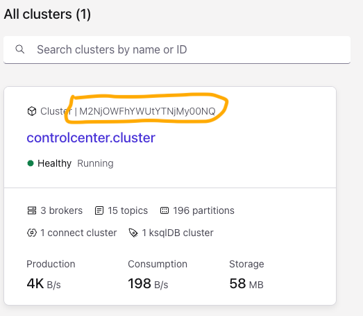
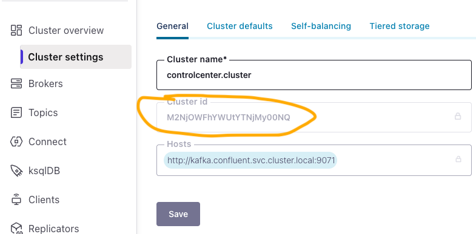
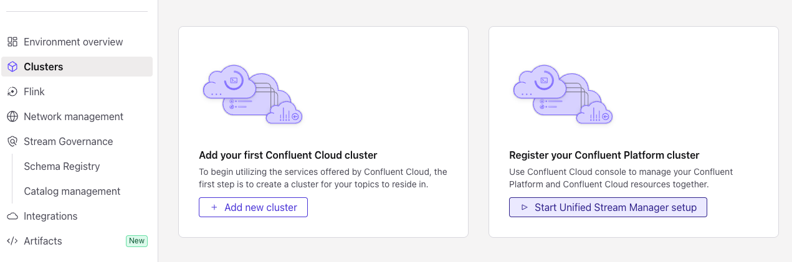
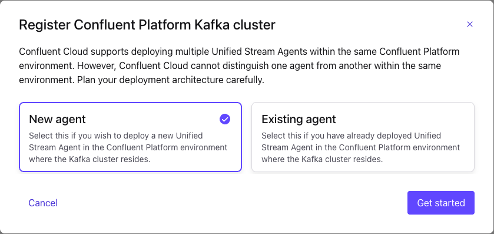
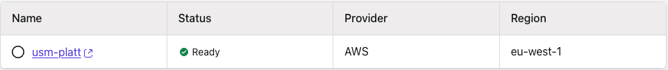
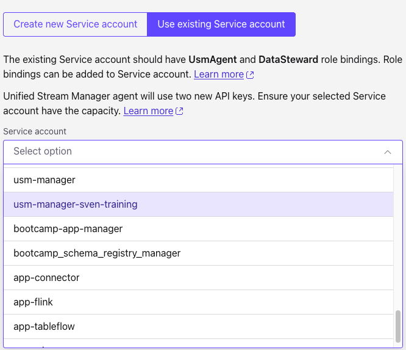
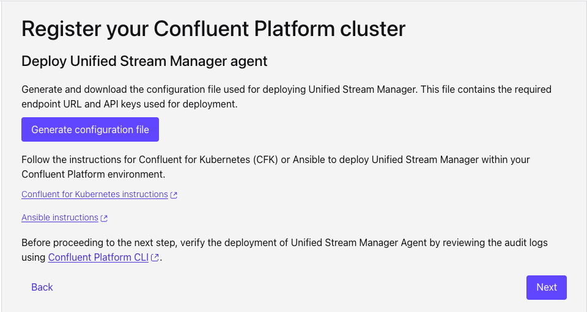
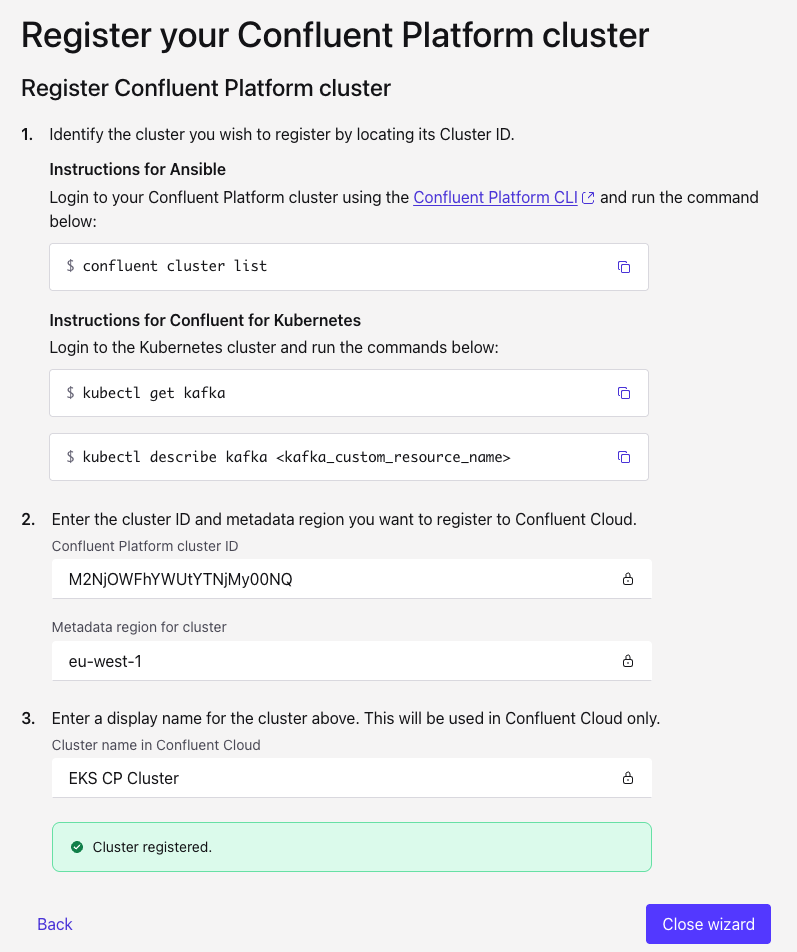
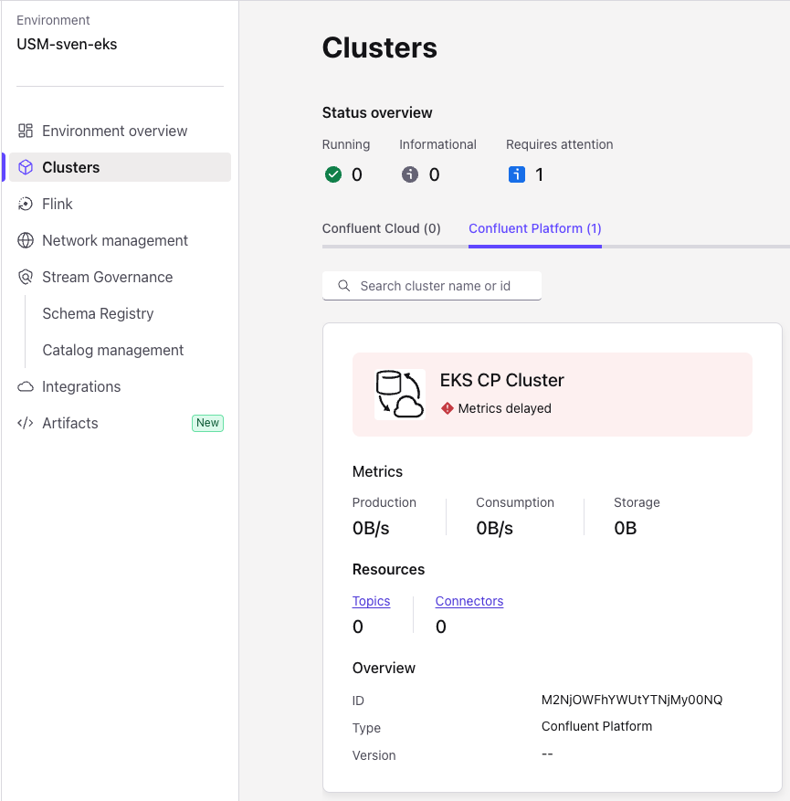
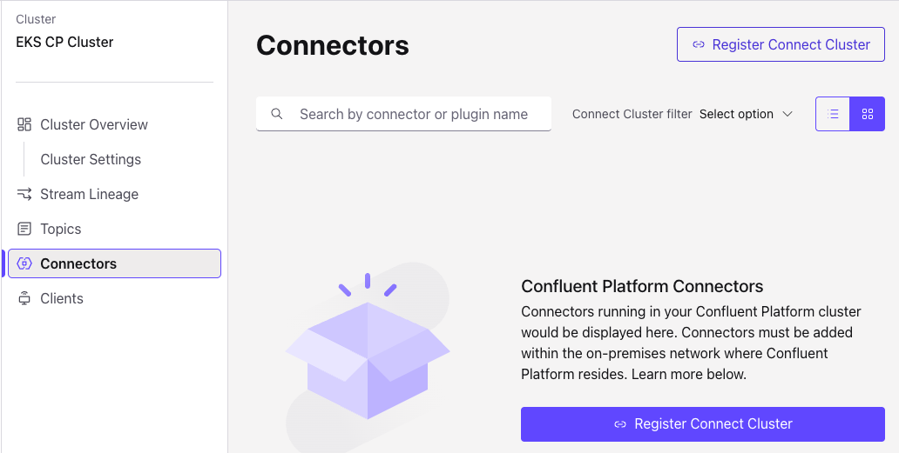

# Lab 1

## Deploy and configure the local cluster with USM

### Install the first cluster

There is a ready-made cluster for you using the file `cp.yaml` that can simply be deployed with `kubectl`:

    kubectl apply -f cp.yaml

This will take a few minutes to complete. You can use `k9s`, `kubectl get pods -w` or a similar method to watch the
cluster being deployed.

Once the deployment is complete, we need the cluster id. The easiest way to get to that information is to use
the Confluent Control Center. Make it accessible via

    kubectl port-forward --address 0.0.0.0 controlcenter-0 9021:9021

If you are using EKS, you can simply connect to the control center in your browser using

    http://localhost:9021

If you are using kind from your jumphost, you need to connect to the IP address of your jumphost instead.
You can find the IP address in the printout of `terraform output`.

    http://<IP-ADDRESS>:9021

The cluster id is located under cluster settings if you click on your `controlcenter.cluster` panel.
Copy and save that name somewhere, we will need it in a moment.

You will not be able to copy and paste the cluster id from here. Instead, navigate into the cluster itself and 
choose the Cluster id from Cluster overview/Cluster settings:

### Register platform cluster

Log into your Confluent Cloud account and find the environment named `USM-<Username>`. Note that there is no cluster
and no schema registry present at this time.

Registering a Confluent Platform cluster is currently a manual process. Head to Clusters in the left panel, then 
choose "Register your Confluent Platform cluster".

In the next panel, choose "New agent" to create a new USM agent and register your cluster.

The Terraform script already created your network configuration under the name "usm-platt", so you just need to it 
select it and continue to the next panel. 

In the next panel, choose an existing Service account created for you with the name "usm-manager-<Your Username>". 
The Terraform script already assigned all the permissions required for this account.

#### Download the configuration

On the next page you can generate the config file you will need to deploy your Unified Stream Manager agent.

As you click on *Generate configuration file* button, your browser will download a JSON file with the required configuration.

### Register your cluster

On the next page, you will finally register your cluster itself. You already have the cluster id from an earlier step
when you opened the Control Center. The wizard you are now in offers an alternative method by querying the Kubernetes
resources themselves. The command 

    kubectl describe kafka

lists information about the cluster you have deployed. One of the entries in the output is the `Cluster ID` you can
filter for.

In step 2 of the wizard
- enter your cluster id
- change the Metadata region for cluster to `us-west-2`

In step 3, choose an appropriate display name for your cluster like `GKO`.  

You can now close the wizard.

#### Observe the schema registry being created for you

If you tried earlier to find your schema registry in your environment, you will find that it has not been created yet.

After registering your platform cluster, Confluent Cloud will automatically create the schema registry for you in
the same region where you registered your cluster. You might have to refresh your browser to see it though.

Head over to the Schema Registry entry on the left hand side under your new environment to find the new entry.
We will need the Private Endpoint and generate an API Key on this page later in Lab 2.

### Register connect cluster

Find your newly registered cluster in the clusters list under Confluent Platform. There should be only one.

Note the warning sign on the cluster - we haven't set up the USM agent on our cluster's side yet.

Click on your newly registered cluster to configure the Connect cluster as well. Find the Connectors link on the 
left hand side of the cluster overview and click on it. As you will see, there are no connect clusters configured yet.

Let's change that now. Click on `Register Connect Cluster`.

In the panel that comes up you need to enter the group id of the connect cluster. 
Ignore the hint; this would only apply to a cluster deployed using Ansible and with RBAC enabled.

Instead, you can run the command 

    kubectl describe connect

and look for the Group ID in the output. It will be `confluent.connect`.

Enter this in the wizard panel and accept the entry by pressing **Finish**.

The Connect overview will now change to "No connectors found", which is correct since we have not configured a 
connector yet.

### Set up usm agent in your Kubernetes environment

The USM agent needs an API Key to contact Confluent Cloud. We will store key and secret as `username` and `password` in
a Kubernetes secret and refer to this secret in the USM agent.

There is a template file called `secret.template` in your repository as a starting place. Copy the `SERVICE_ACCOUNT_API_KEY`
and `SERVICE_ACCOUNT_API_SECRET` from the `usm-agent.config.json` file you downloaded earlier and add the to the 
secret file.

    cp secret.template ccloud-creds.txt
    vi ccloud-creds.txt # or any of your favourite editors
    kubectl create secret generic setu-ccloud-cred --from-file=basic.txt=ccloud-creds.txt

You can now install the USM agent.

Copy the file `usmagent.yaml.template` to `usmagent.yaml` and update where indicated with **<REPLACE ME>** with the values
from your `usm-agent.config.json` file (hint: copy the value of FRONTDOOR_URL to the endpoint). Then apply the USMAgent:

    cp usmagent.yaml.template usmagent.yaml
    vi usmagent.yaml
    kubectl apply -f usmagent.yaml
    kubectl apply -f cp-with-agent.yaml

The last command will perform a rolling restart of all the brokers, which will take a couple of minutes.
You can use `kubectl get pods` to verify the brokers are back up and running.

### Verify the USMAgent updates the metrics in Confluent Cloud

Log into your Confluent Cloud account and verify the cluster is no longer marked in red with delayed metrics,
but instead marked as running.

You can also navigate into the Cluster and should be able to observe a small traffic (from the Control Center) as well as some
existing topics.

### Create a topic and see it being observed in Confluent Cloud

To create a new topic in your cluster, you can execute a bash shell inside one of the Kafka pods:

    kubectl exec -it kafka-0 -c kafka -- bash

In here, you can invoke `kafka-topics` to create a topic:

    kafka-topics --create --topic users --partitions 3 --replication-factor 3 --bootstrap-server kafka:9092

Exit from the bash shell and return to your Confluent Cloud console and refresh the topic list to see new topic 
appearing.

### Create a Datagen connector to create some data (and a schema)

We have added the connector plugin for the Datagen connector to your Confluent cluster. Now is the time to make use of 
it. Running a connector ensures we have a steady load of messages we can observe in the Confluent Cloud. It is 
also an easy way to create a schema for the next lab.

An easy way to set up a connector is to use the Control Center. You can make it accessible by using Kubernetes 
port-forwarding:

    kubectl port-forward --address 0.0.0.0 controlcenter-0 9021:9021

Then go to your browser and access the [Control Center](localhost:9021). Enter the cluster and navigate to Connect and
your connect cluster.

Click on **Add connector**, choose the **DatagenConnector**, give it a name if you like, then add the following information:

| Key                   | Value                                   |
|-----------------------|-----------------------------------------|
| Value converter class | io.confluent.connect.avro.AvroConverter |
| kafka.topic           | users                                   |
| quickstart            | users                                   |

We need to add another property to specify the schema registry URL, but we need to add this by hand. 
Click on **Add a property**, then insert `value.converter.schema.registry.url` here and press **Continue**.

Back in the properties, set the schema registry to `http://schemaregistry.confluent.svc.cluster.local:8081`.

When you click next, your JSON configuration should look like this:

    {
        "name": "DG_Users",
        "config": {
            "value.converter.schema.registry.url": "http://schemaregistry.confluent.svc.cluster.local:8081",
            "name": "DG_Users",
            "connector.class": "io.confluent.kafka.connect.datagen.DatagenConnector",
            "value.converter": "io.confluent.connect.avro.AvroConverter",
            "kafka.topic": "first-topic",
            "quickstart": "users"
        }
    }

# Continue with [Lab2](Lab2.md)

