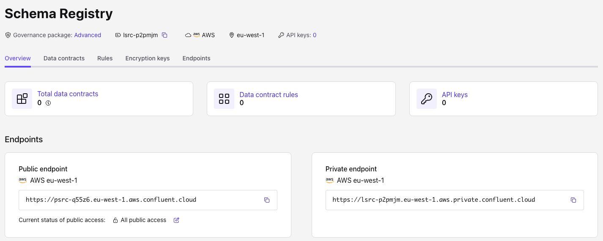

# Lab 2

## Set up the schema registry link, and schem exporter and importer

In this lab, we will set up a schema registry link between your platform cluster and the Confluent Cloud.
We have created a separate environment with its own schema registry in the Confluent Cloud, so we can simply mirror
any schemas of our CP cluster to this Confluent Cloud instance.

Because we let Confluent Cloud create the schema registry for us, the credentials we received when we set up the 
USM Agent did not include the schema registry URL and the associate API Key, so we have to do this step by hand.

### Schema registry URL and credentials

Head to the Confluent Cloud UI and navigate to the schema registry entry in your new environment.

Here , you should find 0 contracts and no API Keys. First, make a note of your Private endpoint.

Then click on API Keys on the right and create a new API Key. Choose the Service Account option and pick
the service account the Terraform script created for you, usually **usm-manager**.

Optionally, give the key a name and a description, then create the API key and make a note of the key and secret and/or
download it. 

### Schema password secret

To create the secret from the schema API key, you can copy the secret template and now add your schema API Key details:

    cp secret.template cc-sr-creds.txt
    vi cc-sr-creds.txt # or your favourite editor, add API key and secret
    kubectl create secret generic cc-sr-credentials --from-file=basic.txt=cc-sr-creds.txt

### Password encoder secret

We also need to add the password encoder secret to Kubernetes. You can simply use the file provided in this repo:

    kubectl create secret generic password-encoder-secret --from-file=password-encoder.txt=password-encoder-secret.txt

### Cluster with schema registry link

Now we need to update the local (CP) Schema registry to inform it about the Confluent Cloud Schema registry.
Copy the template file `schemaregistry.yaml.template` to a new YAML file and update the endpoint as indicated 
with your saved Schema registry endpoint:

    cp schemaregistry.yaml.template schemaregistry.yaml
    vi schemaregistry.yaml # or your favourite editor, replace place holder with SR endpoint
    
### Set up exporters and importers

As a final step we are going to set up the schema exporters and importers. There are two template files we need 
to adjust by adding the Cloud Schema registry endpoint.

    cp schema-exporter.yaml.template schema-exporter.yaml
    cp schema-importer.yaml.template schema-importer.yaml
    vi schema-exporter.yaml
    vi schema-importer.yaml
    kubectl apply -f schema-exporter.yaml
    kubectl apply -f schema-importer.yaml

Documentation: 

[Schema exporter in Kubernetes](https://docs.confluent.io/operator/current/co-schema-registry-switchover.html?session_ref=direct&url_ref=https%3A%2F%2Fdocs.confluent.io%2Fplatform%2Fcurrent%2Fusm%2Fusm-schema.html#set-up-a-schema-exporter)

[Schema importer in Kubernetes](https://docs.confluent.io/operator/current/co-schema-registry-switchover.html?session_ref=direct&url_ref=https%3A%2F%2Fdocs.confluent.io%2Fplatform%2Fcurrent%2Fusm%2Fusm-schema.html#set-up-a-schema-importer)

### Observe schema transfer and metrics

Once the exporter is running, you should be able to observe one new data contract in the Confluent Cloud schema registry,
originally created by the connector we earlier deployed.

You can create additional schemas in your CP deployment and see them being exported, and maybe add a new schema
in the Confluent Cloud schema registry and see it travel the other way.

# Finally, cleanup

Whatever method you used to create your Kubernetes cluster, the deployment will consume resources and incure cost.
In the spirit of **#tasty-not-wasty**, please clean up your resources again once you are done with the labs:

    terraform destroy -auto-approve

This command will destroy any AWS resources you have created and also remove the registration of your platform cluster,
the schema registry and the environment in Confluent Cloud.

**Congratulations, you reached the end of the workshop**
